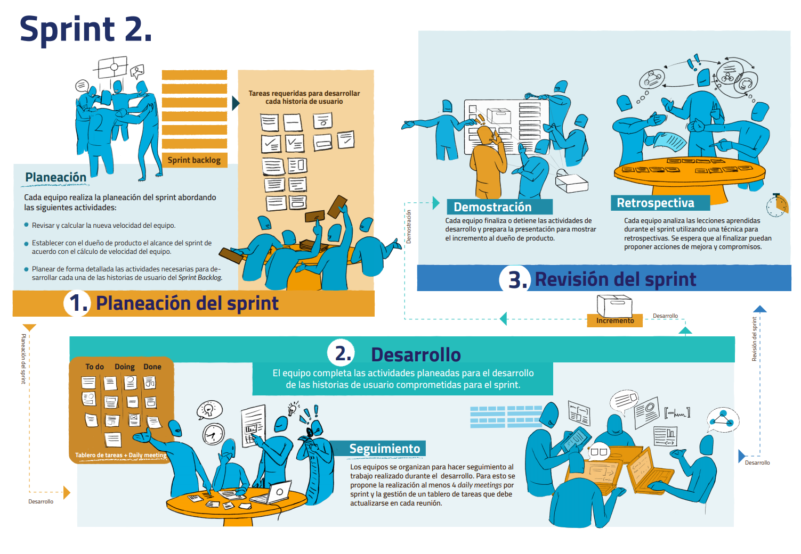

## Sprint 2

### Descripción
---
 
Para dar inicio al segundo sprint cada equipo debe preparar su backlog, recalcular la velocidad del equipo y programar una reunión de priorización con el dueño de producto para definir las historias de usuario del sprint. Posterior a esto, el equipo debe realizar la planeación detallada con el fin de definir las actividades necesarias para desarrollar cada historia de usuario del *Sprint Backlog*. En el sprint se realiza el diseño, la implementación y las pruebas del sistema. Toda la documentación del proyecto debe organizarse en la wiki de GitHub.

El equipo debe hacer seguimiento a las actividades mediante *daily meetings* y la actualización del tablero de tareas. Adicional a lo anterior se propone una actividad de refactorización para mejorar la calidad del código desarrollado. Finalizando el sprint cada equipo debe preparar la demostración del producto terminado al cliente y los insumos necesarios para realizar la retrospectiva.

 

<table>
  <thead>
    <tr>
      <th colspan="2" class="tg-0lax">Detalle de objetivos y actividades por semana</th>
    </tr>
  </thead>
  <tbody>
    <tr>
      <td>Semana 6</td>
      <td>
        <a href="{{ '/semanas/sprint2/semana6/semana6' | absolute_url }}">Ver detalle</a>
      </td>
    </tr>
    <tr>
      <td>Semana 7</td>
      <td>
        <a href="{{ '/semanas/sprint2/semana7/semana7' | absolute_url }}">Ver detalle</a>
      </td>
    </tr>
  </tbody>
</table>

### Entregables y criterios de evaluación
---
 

>**Los criterios detallados a continuación equivalen el 25% de la calificación del proyecto.  
>La sustentación corresponde al 5%.**

 

